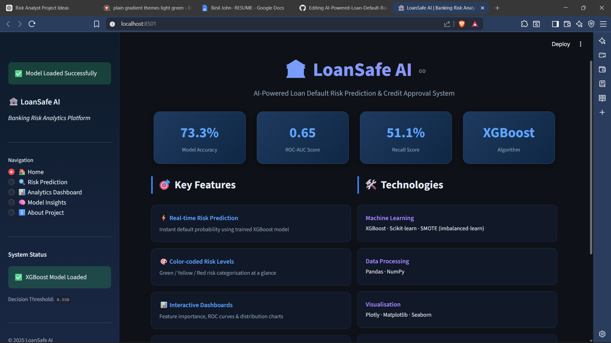
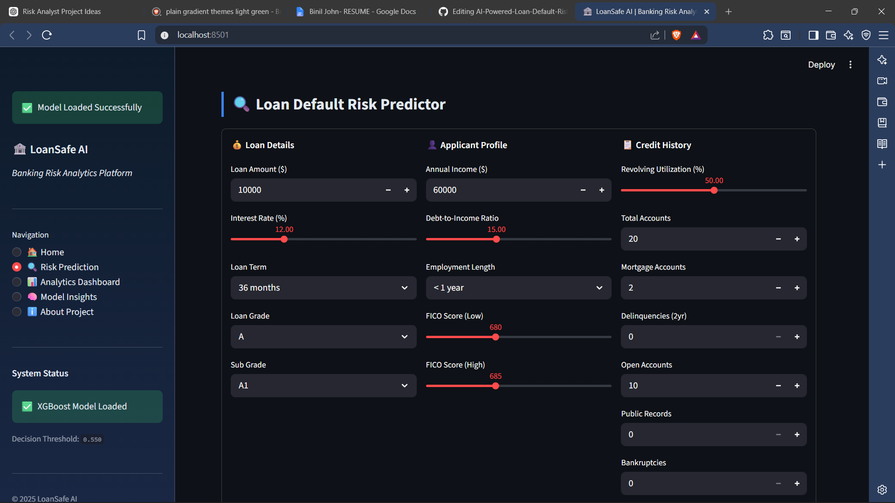
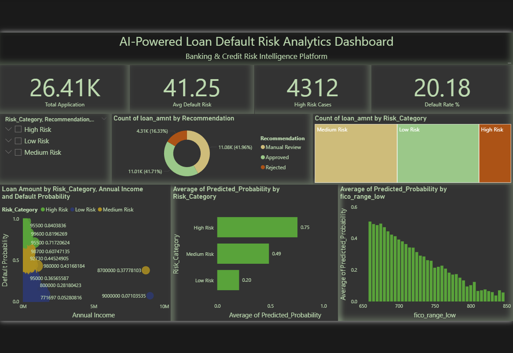

# AI-Powered Loan Default Risk Prediction and Credit Approval System

## Overview
An end-to-end AI and Business Intelligence project for predicting loan default risk using XGBoost, Streamlit, and Power BI.

This project is a machine learning-based banking risk analytics system designed to predict loan default risk and provide intelligent credit approval recommendations.

The system uses real-world Lending Club loan data and applies advanced machine learning techniques to classify borrowers into risk categories.

---

## Features

- Loan Default Prediction
- Credit Risk Scoring
- Loan Approval Recommendation Engine
- Risk Categorization (Low / Medium / High Risk)
- XGBoost-based Machine Learning Model
- Imbalanced Data Handling using SMOTE
- Feature Importance Analysis
- Streamlit Dashboard Integration
- Real-world Financial Dataset

---

## Technologies Used

- Python
- Pandas
- NumPy
- Scikit-learn
- XGBoost
- Streamlit
- Matplotlib
- Seaborn
- SHAP
- Joblib

---

## Machine Learning Models Used

- Logistic Regression
- Random Forest Classifier
- XGBoost Classifier

XGBoost was selected as the final model due to better recall and ROC-AUC performance for detecting risky borrowers.

---

## Power BI Dashboard

Developed an interactive Power BI dashboard for loan default risk analytics featuring:

- KPI monitoring for default risk and high-risk borrowers
- Risk segmentation (Low / Medium / High)
- Approval recommendation analytics
- Income vs risk visualization
- FICO score analysis

Dashboard built using 26K+ loan application records and ML prediction outputs.

---

## Dataset

Dataset used:
Lending Club Loan Dataset

The dataset contains:
- Loan Amount
- Interest Rate
- Annual Income
- Debt-to-Income Ratio
- Credit History
- FICO Scores
- Employment Length
- Loan Status
- and other financial indicators

---

## Project Workflow

1. Data Collection
2. Data Cleaning and Preprocessing
3. Feature Selection
4. Handling Missing Values
5. Encoding Categorical Variables
6. Handling Imbalanced Data using SMOTE
7. Model Training
8. Model Evaluation
9. Risk Scoring
10. Streamlit Dashboard Deployment

---

## Model Evaluation

### Final XGBoost Model Performance

- Accuracy: ~72%
- Recall for Default Detection: ~50%
- ROC-AUC Score: ~0.64

The model was optimized to improve default detection recall rather than maximizing raw accuracy, which is more important in banking risk analytics.

---

## Risk Categories

| Risk Score | Category |
|---|---|
| 0 - 35 | Low Risk |
| 35 - 70 | Medium Risk |
| 70 - 100 | High Risk |

---

## Loan Recommendation Logic

- Low Risk → Approve
- Medium Risk → Manual Review
- High Risk → Reject

---

## Folder Structure

```bash
loan-default-risk-prediction/
│
├── data/
├── notebooks/
├── models/
├── app/
├── visuals/
├── README.md
└── requirements.txt
```

---

## How to Run

### Install Dependencies

```bash
pip install -r requirements.txt
```

### Run Streamlit App

```bash
streamlit run app/streamlit_app.py
```

---

## Future Improvements

- Hyperparameter Tuning
- Advanced Feature Engineering
- Real-time Risk Monitoring
- Cloud Deployment
- API Integration

---

# 📸 Project Screenshots

## Streamlit Application

### Home Page


---

### Risk Prediction


---

## Power BI Dashboard



---

## Author

Binil John
